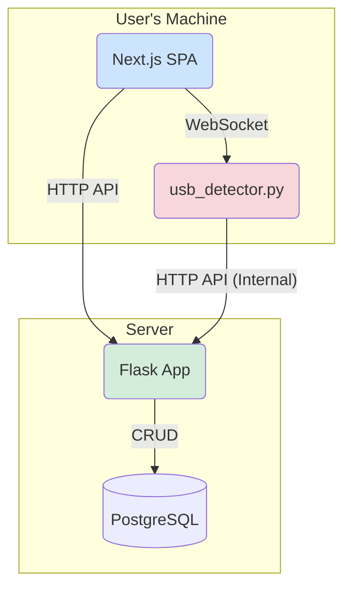
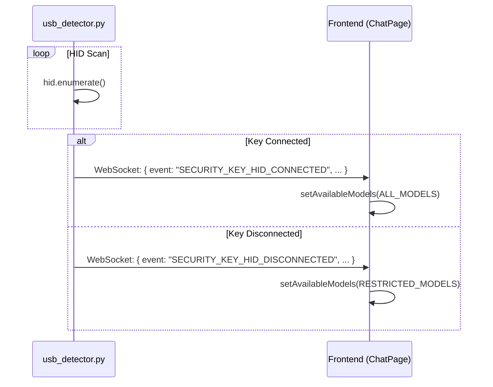

# System Patterns: Argus AI Secure POC

## 1. High-Level Architecture

The system is composed of three main components:

1.  **Frontend (Next.js):** A single-page application that provides the user interface for chat and administration. It communicates with the backend via HTTP REST API calls and a WebSocket connection.
2.  **Backend (Flask):** A Python-based server that handles business logic, user authentication, database interactions, and serves the REST API.
3.  **USB Detector (Python):** A standalone Python script that runs in the background. Its sole responsibility is to monitor for hardware USB events (specifically, HID security keys) and report them.



## 2. Authentication and Session Flow

1.  **Initial Login:** User logs in via the `frontend` using username/password. The `backend` verifies credentials against the `Users` table in the database.
2.  **Session Token:** Upon successful password verification, the `backend` creates a session in the `AuthenticationSession` table and returns a session token to the `frontend`.
3.  **Security Key MFA:** If the user has a registered key, they are prompted for a WebAuthn ceremony. The `frontend` orchestrates this with the `backend`'s WebAuthn endpoints.
4.  **Authenticated State:** Once fully authenticated, the `frontend` stores the user data and session token in `sessionStorage`. All subsequent API requests to the `backend` include this token in the `Authorization` header.

## 3. Real-time USB Event Flow (Current Flawed System)

1.  **Detection:** The `usb_detector.py` script continuously scans for HID devices.
2.  **Broadcast:** When a FIDO key is connected or disconnected, the detector broadcasts a generic event (`SECURITY_KEY_HID_CONNECTED` / `DISCONNECTED`) to all connected WebSocket clients (i.e., all active `frontend` instances).
3.  **Frontend Reaction:** The `frontend` receives the WebSocket message and, based on the event type, either expands or restricts the available AI models.
4.  **Internal API Call:** The `usb_detector.py` also makes an *internal* API call to the `backend` (`/api/internal/hid_security_key_event`) to associate the detected `vendor_id` and `product_id` with a `SecurityKey` record in the database. This is a "fire-and-forget" update and doesn't directly influence the frontend's immediate reaction.

## 4. The Core Problem Pattern

The current flow is a **System-to-All-Users Broadcast**. The `usb_detector.py` is unaware of which user is logged in on which frontend instance. It simply announces a system-wide event.


This is insecure because `Frontend` acts on the broadcast without verifying if the key belongs to its specific user.

## 5. Proposed Secure Pattern: User-Specific Verification Flow

The new pattern will shift the responsibility of verification to the `backend` and make the communication user-specific.

1.  **Detection & User Info:** The `usb_detector.py` detects a key and sends the event via WebSocket, but this time it will also include the **user's session token** which the frontend will provide upon connection.
2.  **Backend Verification:** The `usb_detector.py` will now call a new, more intelligent `backend` endpoint. It will send the key's `serial_number` and the `user's session token`.
3.  **Ownership Check:** The `backend` will:
    a. Validate the session token to identify the user.
    b. Look up the `SecurityKey` record by its `serial_number`.
    c. Compare the `user_id` from the session with the `user_id` on the `SecurityKey` record.
4.  **Targeted Frontend Update:**
    a. **If Match:** The `backend` will use a targeted mechanism (like Socket.IO rooms or a user-specific channel) to send a "permission granted" message *only* to the specific user's frontend session.
    b. **If No Match:** The `backend` will send a "permission denied" message to the user's session, which the frontend will display as an error toast.

```mermaid
sequenceDiagram
    participant F as Frontend
    participant D as usb_detector.py
    participant B as Backend (Flask)
    participant DB as Database

    F->>D: WebSocket Connect (with user session token)
    D->>D: Store token with connection

    ...Key is plugged in...

    D->>D: hid.enumerate() -> Gets Serial Number
    D->>B: API: /verify-key-ownership (serial, session_token)
    B->>DB: Find User from session_token
    B->>DB: Find Key from serial_number
    DB-->>B: Return User & Key records
    B->>B: Compare user.id vs key.user_id

    alt Match
        B->>F: WebSocket (User-specific): { event: "MODELS_UNLOCKED" }
        F->>F: setAvailableModels(ALL_MODELS)
    else No Match
        B->>F: WebSocket (User-specific): { event: "KEY_MISMATCH_ERROR" }
        F->>F: toast.error("Key does not belong to you")
    end
```
This new pattern ensures that the `backend` is the single source of truth for authorization, and the frontend only reacts to authenticated, user-specific commands.